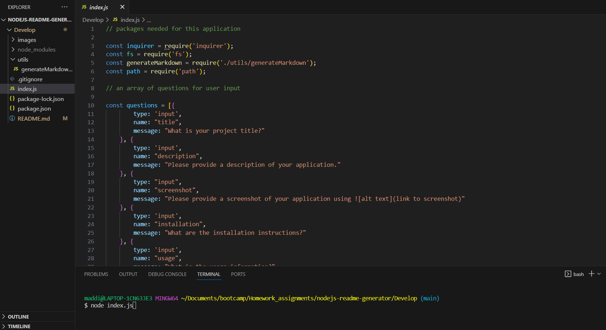

  # nodejs-readme-generator

  ## Description

  This application was created to demonstrate how to generate files through the terminal, using a README as the example. Creating a README through the terminal may make the process easier for beginners, as the user will be given a series of set questions to respond to, generating a README that includes all the proper information without having to memorize it. In doing this project, I improved my knowledge on the use of inquirer.

  ## Table of Contents

  - [Installation](#Installation)
  - [Usage](#Usage)
  - [Credits](#Credits)
  - [License](#License)
  - [Tests](#Tests)
  - [Questions](#Questions)

  ## Installation

  The user must have node.js and inquirer installed in order to use this application.

  ## Usage

  To use, run node index.js inside the terminal of the Develop folder of this application (as shown in the screenshot), then answer the question prompts as they are shown. After the questions have finished, a README file will be generated.
  

  ## Credits

  I used the following links to assist in my building of this application: https://coding-boot-camp.github.io/full-stack/github/professional-readme-guide, https://gist.github.com/kofiav/c1059e1075b67582e86b07aa9759e20d

  ## License

  
    
    (https://opensource.org/license/MIT)
  

  ## Tests

  To test, run the application as explained in the #usage section.

  ## Questions

  'https://github.com/maddieeckstrom'
  If you have any additional questions, please contact me at: maddieeckstrom@gmail.com

